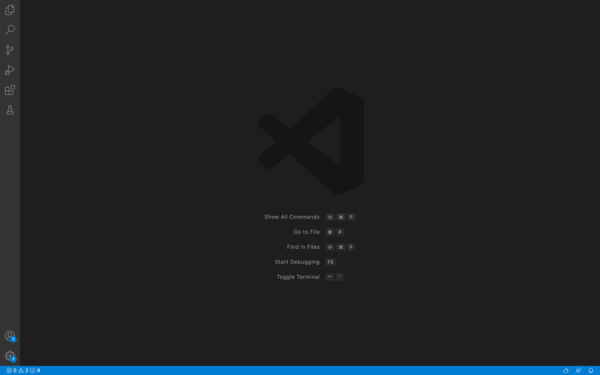
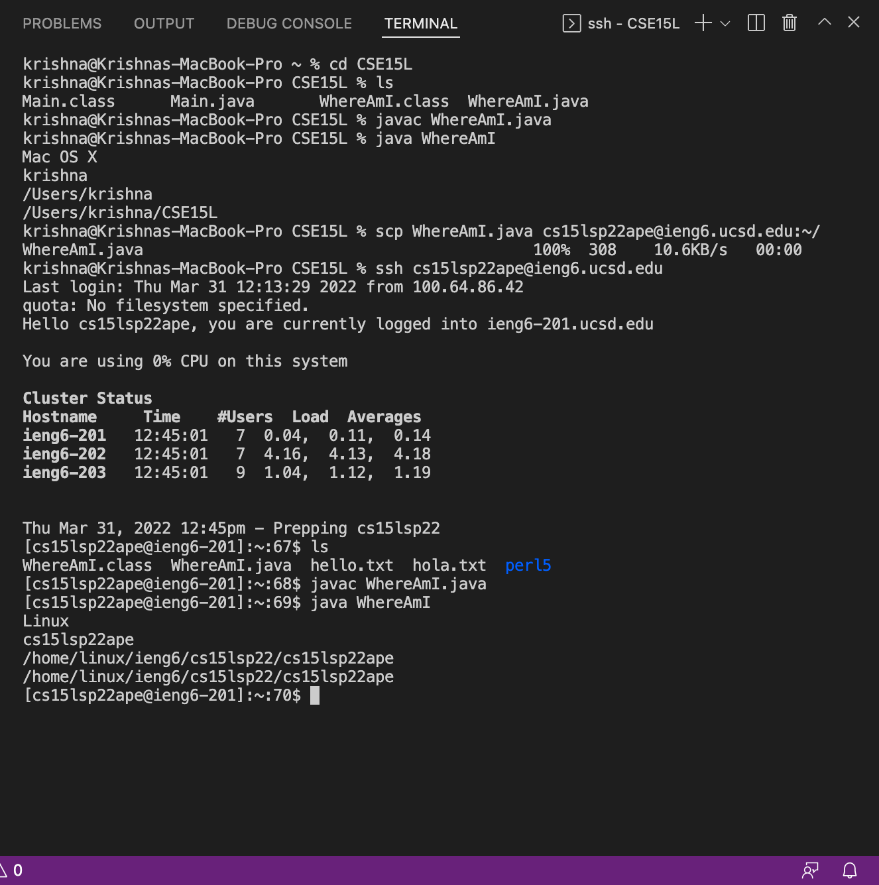

# **CSE 15L Lab Report 1**

## Krishna Reddy

## **Installing VS Code:**

To download VS Code, I went to the Visual Studio Code Website, https://code.visualstudio.com/ and followed the instructions. Since this process was very simple and there was no confusion, I was able to check how VS Code works with no difficulties at all.



## **Remotely Connecting:**

 Basically, we use a ```ssh``` command which is short for secure shell to connect to a remote computer or machine that belongs to the school. So, we use this ssh command to access the remote computers from our local machine through our account. Once we are connected to one of the remote servers we are going to use linux irrespective of what your local computer is running on. This is because the remote computers use linux.
 After we enter the ```ssh``` command with the hostname and our username, we are going to be prompted for a password that is unique to each person. After you enter the password you might see some warnings if it is your first time connecting to the ieng6 server. Finally, after saying yes to the warnings we will be able to access the server.

 


 ## **Trying some Commands:**

In the lab, all of our groupmates tried out different kinds of commands to see what the output would be. I tried all the variations of the ls command. These were fun but I could not figure out what they were doing. The first one, ```ls -a```, showed all the hidden files in a directory. The second one, ```ls -l```, showed complete details of the file, such as when it was created, how memory size it takes up etc. The last one, ```ls -t```, listed the files in the directory based on time it was created, from the most recent file to the oldest file. The command I had found most interesting was the ls -lat command which listed the files in a directory and perfomed the functions of ls -a, -l, and -t at the same time.


## **Moving Files with scp:**

Moving files with ```scp``` means that we move some files from our local computer to the server using secure copy or scp. Here, we write the command scp followed by the name of the file we want to move which is followed by the host and user name of our remote server. We will be prompted for a password and after entering it, our file will appear in directory on the server. We can check if our file is there or not by using the ls command. If we have a java file like I did in the lab, we can run and compile the java file and it will still work even on the remote server. 



## **Setting an SSH Key:**

The idea behind setting an ssh key here is to ensure that we are not prompted for the passowrd everytime we are trying to login to the remote server or move files from your local machine to the server. We can start doing this with the command called ```ssh-keygen```. This command creates a public and private key and we copy the public key to the remote server and store the private key on our local machine. The ssh command can use these files instead of our password. 


Now we have to login to the remote server and create a directory called .ssh using the command ```mkdir .ssh```. We then use ```scp``` to copy the public key to the .ssh directory on the server.
After completing all of the steps listed above, we can see that we easily use a ssh command to login to the server without a password. 


## **Optimizing Remote Running:**

In the command of the screenshot below, we can see that using the command ```scp WhereAmI.java cs15lsp22ape@ieng6.ucsd.edu:~/; ssh cs15lsp22ape@ieng6.ucsd.edu "javac WhereAmI.java; java WhereAmI" ``` helps us to first make a copy of the file, login to the remote server and then compile and run the java file. Doing this can help us a lot as this extremely efficient as it saves us time and reduces the amount of keystokes we have to use. 


We can clearly see that using this command is much more efficient than doing these commands seperately as they will take much longer time to run which will decrease our efficiency. Techniques like this can help us save a lot of time and use less keystrokes. The process by itself takes 126 keystrokes so we can say that using the command above can be extremely useful and logical. Another command that really helps me a lot and makes the process of coding entertaining is the ```CTRL+R``` with the up-arrow which helps us go through out previous commands by using a recurisve backward search.
