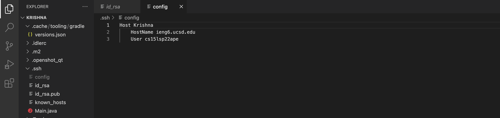
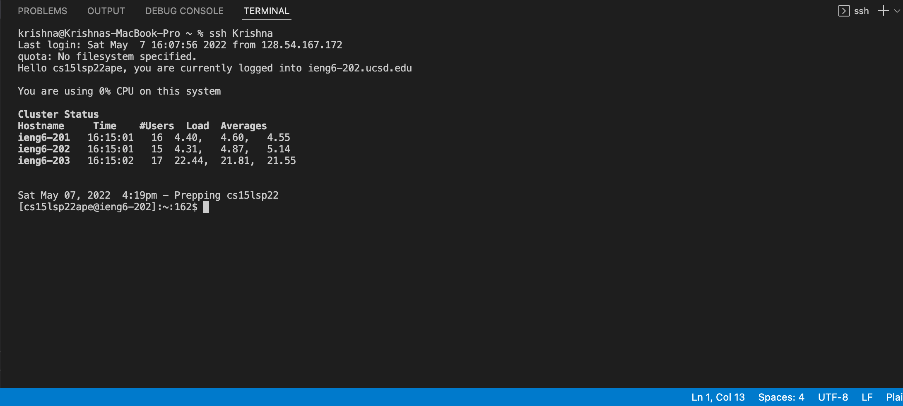
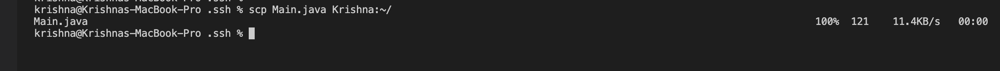
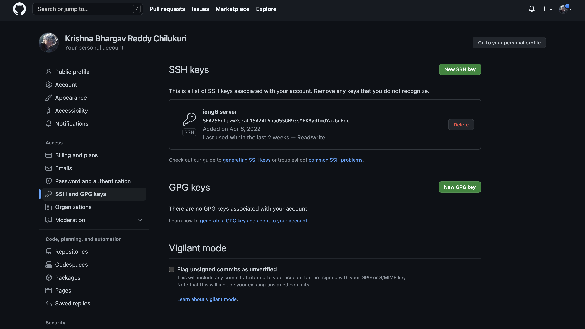
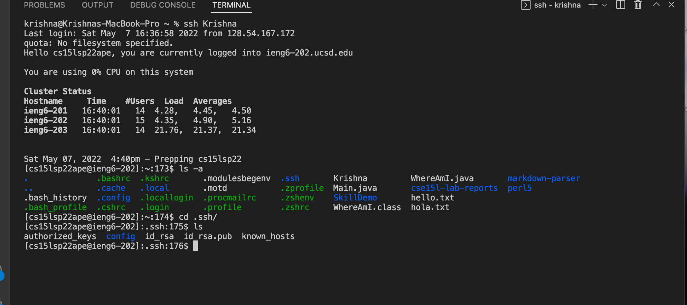
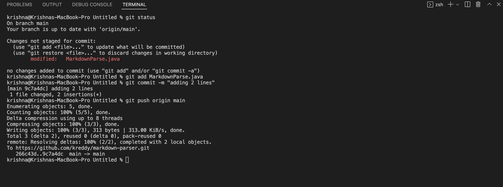

# **CSE 15L Lab Report 3**
## Krishna Reddy
*******

## **Streamlining `ssh` Configuration:**
**Creating/Editing the Config file:**

After opening `.ssh` directory on your local machine using the path `.ssh/config` we have to edit the file to add text that will help us login to our server account with the help of our username. We can set the name of the host to anything that is convenient and easy to type.

**Logging in with the `ssh` alias:**

Here we can see that I can easily login to my ssh account using `ssh Krishna` because I set the name of my host to `Krishna`. We can be sure that this is my account because I set up the config file to my specific `cs15lsp22` username.

**Using `scp` to copy files with the alias:**

I can copy over a file from the local machine to the server using the `scp Main.java Krishna:~/` command.

*****

## **Setup Github Access from ieng6:**

**Public Key on Github:**

Here, I have stored the ieng6 server's public as an `ssh` key on github so that we can easily use commands like git pull or push directly between the remote Sever and Github.

**Public and Private Keys on User Account:**

If we login to the server, we can see only see `.ssh` directory if we use `ls -a` which helps see the hidden files. If we `cd` into `.ssh` and use `ls`, we can notice that the public and private keys for the server are stored in here as files. The public key is stored in `id_rsa.pub` and the private key is stored in the file `id_rsa`.

**Git commands to commit and push changes:**

When we use the `git status` command it shows us that the MarkdownParse.java file was modified. So we can now use the commands `git add` and `git commit` to add these changes to the staging area and commit them. After that we use `git push origin main` to push the changes to the origin (Github). We can see that the changes were because of our public key stored on the github website.

**This is the [link](https://github.com/kreddy/markdown-parser/commit/9c7a4dca48f6f5277de0792913bb38158460f847) to the commit on the github website**.

*******

## **Copy whole directories with `scp -r`:**

