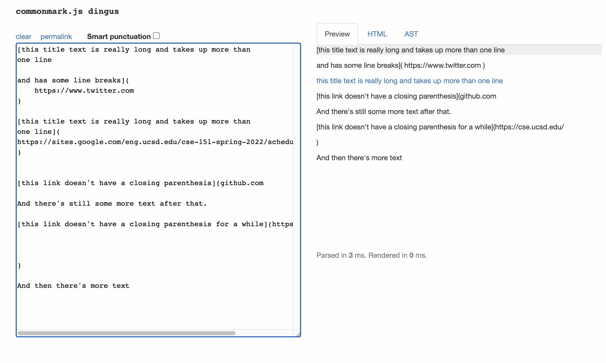
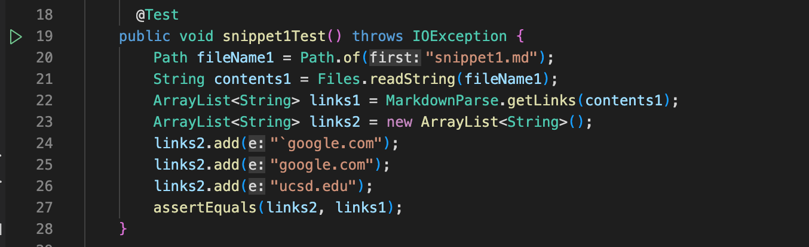
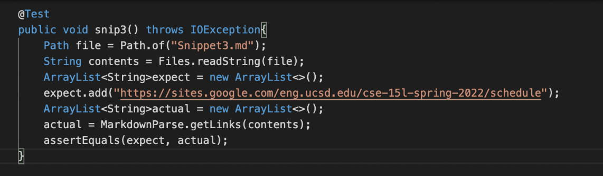

# **CSE 15L Lab Report 4**
## Krishna Reddy
*******

**Using CommonMark Demo to see the Expected Output:**

**Snippet1:**

**Snippet2:**

**Snippet3:**

******

**[MyMarkdownParse](https://github.com/kreddy/markdown-parser)**

I have attached my repo's link for MarkdownParse above. Now let's what test I run with them for the different Snippets,

**Snippet1 Test:**

**Snippet2 Test:**

**Snippet3 Test:**

When we run these test these are the outputs we use for the following tests, 

**Snippet1 Output:**

**Snippet2 Output:**

**Snippet3 Output:**

We can see that all of my test fail for all of the Snippets and I will show the fixes for these later in this lab report. For now I would like to present the MarkdownParse Repo that me and my groupmates from the lab looked at in Week 7.

[Reviewed MarkdownParse](https://github.com/aHewig/markdown-parser)

This is the MarkdownParse directory that we looked at it in Week 7. 

**Snippet1 Test:**

**Snippet2 Test:**

**Snippet3 Test:**

When we run these tests we get the following output for these snips,

**Snippet1 Output:**

**Snippet2 Output:**

**Snippet3 Output:**

*****

**Answering Questions for the Lab Report:**

1. Do you think there is a small (<10 lines) code change that will make your program work for snippet 1 and all related cases that use inline code with backticks? If yes, describe the code change. If not, describe why it would be a more involved change.

**Ans:**
It is possible to do it in under 10 lines of code. I think it would need to be a small change. If we can check if the character at the index before the open bracket is a backtick, we can make sure that no false links are added. I think that is the main issue here and the fix can be implemented in under 10 lines.

2. Do you think there is a small (<10 lines) code change that will make your program work for snippet 2 and all related cases that use inline code with backticks? If yes, describe the code change. If not, describe why it would be a more involved change.

**Ans:**
Here, there is an `OutOfBoundsException`. To fix this, I think there would be a solution that is longer than 10 lines. If I had to do in under 10 lines of code, I would violating a lot of the clean coding guidelines. So to fix this, we have to add another `if` statement to make sure `OpenBracket` is not 0. And we have to do something else, I'm not sure what I have to implement after the `if` statement to make sure it works. I will probably need to add more than 10 lines because will have to change the method to add links and account for cases that nest parentheses, brackets etc.

3. Do you think there is a small (<10 lines) code change that will make your program work for snippet 3 and all related cases that use inline code with backticks? If yes, describe the code change. If not, describe why it would be a more involved change.

**Ans:**
Similar to the Snippet 2 above, I think this would also require more than 10 lines of code. For this snippet, in addition to the change that would require to consider to the issue for the `OutOfBoundsException` we also need to consider that links that line breaks are not considered. So, we would have add more code which can't be done in less than 10 lines and will not follow clean coding guidelines.

*****