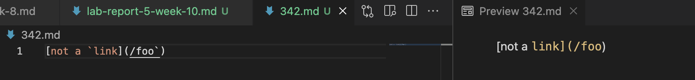
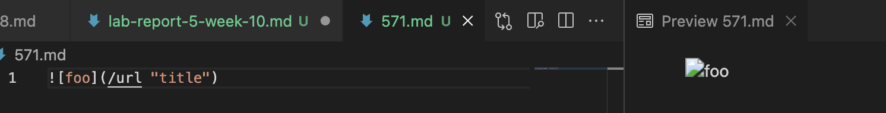

# **CSE 15L Lab Report 5**
## Krishna Reddy
*******

In this lab report, I used `vimdiff` to find the tests with different results. To be more specific, I used the command,
 `vimdiff my-markdown-parser/results.txt cse15lsp22-markdown-parser/results.txt`

The test files that I looked at were:

 1. [Test-file 342](https://github.com/nidhidhamnani/markdown-parser/blob/main/test-files/342.md)

 We can see here our expected output,

 

Here we can see,

 

 We can clearly see that neither implmentation is correct, as neither of them produce the output that we expected.

 2. [Test-file 571](https://github.com/nidhidhamnani/markdown-parser/blob/main/test-files/571.md)

 We can see here our expected output,

 

 For this test file, the given implementation produces the correct output while my implementation does not.

 Bug in Code: The problem here is that this test file has an image and my implementation does not have a way to deal with these files. So, making changes to the code to make sure that the files with images in them can be handled would be the right way to handle this.

 *****
